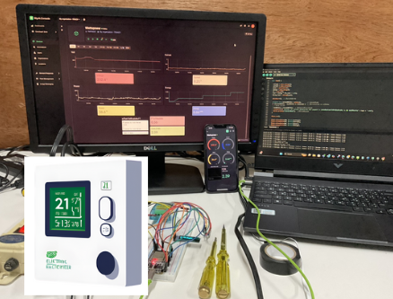

# WattsUp: Smart Energy Monitoring System
 
 
The **WattsUp: Smart Energy Monitoring System** is a smart energy management solution designed to monitor and control household power consumption in real time. It uses an **ESP32** microcontroller connected to a **PZEM-004T V3.0** sensor to measure voltage, current, power, and energy consumption. The system transmits data to the **Blynk app** for real-time monitoring and cost calculation, allowing users to adjust the electricity tariff (FT) and receive alerts for abnormal values. A built-in relay and buzzer provide protection by automatically cutting off power and sounding an alarm when overvoltage or overcurrent is detected. Additionally, the system logs data to **Google Sheets** for easy tracking and analysis. This project aims to improve energy efficiency and provide a reliable solution for managing electricity usage at home.

## 🌟 Features
### ✅ 1. Real-time Energy Monitoring
- Measure Voltage
- Measure Current
- Measure Energy Consumption
- Measure Power
- Measure Power Factor (pf)

### 📲 2. Data Transmission to Blynk App
- Display real-time energy values on the Blynk app
- Update the electricity tariff (FT) through the Terminal on Blynk
- Change the color in Blynk according to the FT value (Green if negative, Red if positive)
- Send energy and cost values to Blynk Virtual Pins

### 📧 3. Alert and Automatic Power Cutoff System
- Detect overvoltage or undervoltage conditions
- Detect overcurrent conditions
- Send email alerts when energy consumption exceeds the limit (via Google Apps Script)
- Automatically cut off power through the relay if abnormal values persist for more than 10 minutes

### 💾 4. Data Logging to Google Sheets
- Send energy and cost data to Google Sheets
- Use Google Apps Script for automatic data updates

### 🖥️ 5. OLED Display Output
- Display real-time values of Energy, Cost, and Units
- Update every 5 seconds

### 🚨 6. Buzzer for Alerts
- Trigger an alert when voltage or current is abnormal

Sound the buzzer when electricity cost exceeds the set limit

### 🔋 7. Surge and Overcurrent Protection
- Automatically cut off power when voltage or current exceeds the limit
- Resume power when values return to normal

## 🛠️ Hardware
#### 🔹 1. ESP32
#### 🔹 2. PZEM-004T V3.0 (10A)
#### 🔹 3. OLED Display (128x32, I2C)
#### 🔹 4. Relay Module (10A)
#### 🔹 5. Buzzer
#### 🔹 6. Power Supply (AC to DC 5V)
#### 🔹 7. Resistors and Connectors (Misc)
#### 🌐 8. Internet Connection

